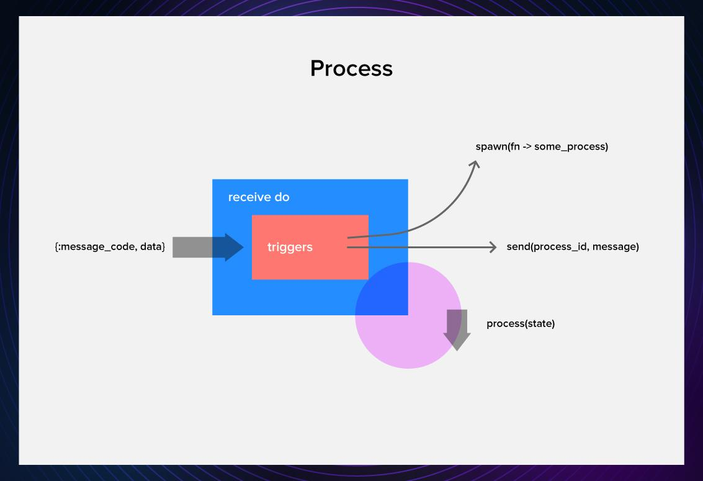
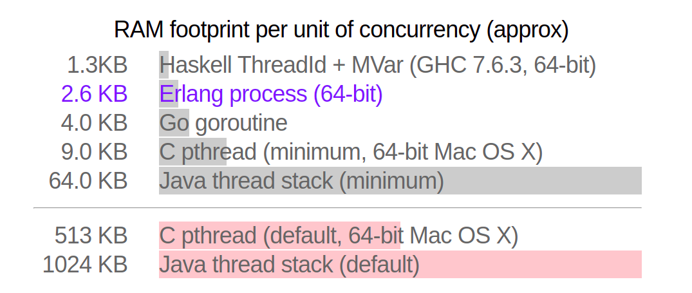
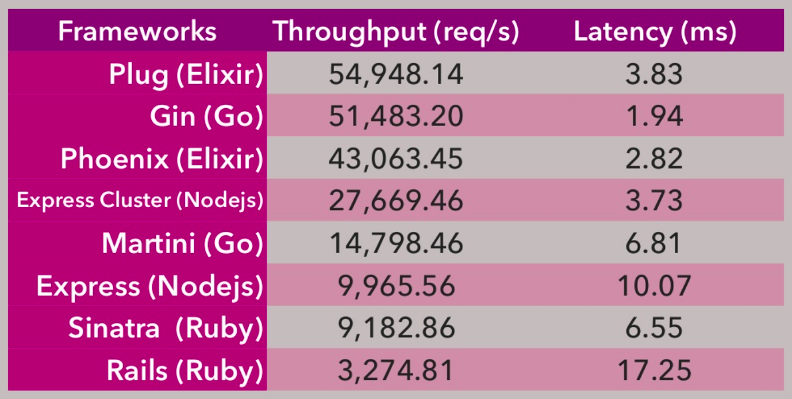
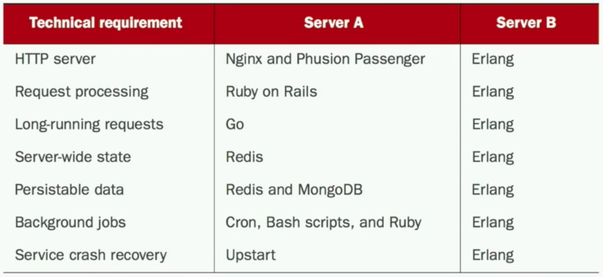

<h1 class="pl-16 font-sans text-purple-600"> Elixir </h1>

<div class="bg-opacity-40 bg-dark-600 w-86 p-2 rounded text-center">
Programming language of the future
</div>

---

# What is Elixir?

<div class="flex flex-row w-full">
  <ul class="w-1/2">
    <li v-click>General purpose</li>
    <li v-click>Dynamic (strong)</li>
    <li v-click>Functional</li>
    <li v-click>OOP (no classes, but actors 😉 )</li>
    <li v-click>Concurent & parallel</li>
    <li v-click>Immutable</li>
    <li v-click>Distributed</li>
    <li v-click>Fault-tolerant</li>
    <li v-click>Productive</li>
    <li v-click>Awesome! 🤍</li>
  </ul>

  <div class="w-1/2">
    <h2 v-click>Who uses Elixir/Erlang?</h2>
    <ul v-click>
      <li>
        Discord uses Elixir for their large-scale messaging system. Using Rust to Scale Elixir from 5 to 11 Million Concurrent Users 😮
      </li>
      <li>
        WhatsApp - 2 Million connections on one node/server, Facebook (chat backend)
      </li>
      <li>
        Motorola Solutions uses Erlang and Elixir for mission-critical communication systems that need to be reliable and fault-tolerant.
      </li>
      <li>
        Moz uses Elixir for the backend of their digital marketing and SEO toolset, Moz Pro
      </li>
    </ul>
    <div v-click>
      <h3>A happy accident?</h3>
      <p class="text-sm">Created by Jose Valim ~ 2011, accidentally 😆</p>
    </div>
  </div>
</div>

---
background: "./assets/gradient.svg"
---

# Pros/Cons

<div class="flex flex-row items-stretch justify-around">
  <div>
    <h2>Pros</h2>
    <ul>
      <li v-click> Concurrency </li>
      <li v-click> Scalability </li>
      <li v-click> Fault tolerance </li>
      <li v-click> Phoenix framework </li>
      <li v-click> OTP (Erlang VM, Mnesia, Actor Model, ETS)</li>
    </ul>
    
  </div>

  <div>
    <h2> Cons </h2>
    <ul>
      <li v-click> Immature ecosystem </li>
      <li v-click> Weak FLOPS game </li>
      <li v-click> Small community </li>
      <li v-click> Small tallent pool </li>
    </ul>
  </div>
</div>

---

# Cost of concurrency?

<div class="flex pt-20">
  
</div>

---

# HTTP Benchmark

<div class="flex pt-10">
  
</div>

---

# Erlang (by extent Elixir) Ecosystem vs Everybody

<div class="flex pt-20">
  
</div>

---
layout: center
---

# Data types in Elixir

<div class="grid grid-cols-2 gap-10">
  <div>
    <h3>Primary (value types)</h3>
    <ul v-click>
      <li> Integers (arbitrary-precision) </li>
      <li> Floats </li>
      <li> Atoms  <span class="text-orange-400">true, false, nil</span></li>
      <li> Range 0..10 </li>
      <li> Regex ~r/{expression}/</li>
    </ul>
  </div>

  <div>
    <h3> Collection types </h3>
    <ul v-click>
      <li> Tuples -> {:ok, 42, "next"} </li>
      <li> Linked lists (closest to arrays) -> [1, "Hello", :ok] </li>
      <li> <div class="flex flex-row items-center"> Binaries <uim-angle-double-left /> 1,2 <uim-angle-double-right /> </div> </li>
      <li> Maps (key-value) -> %{"id" => 1, name: "Nikola"} </li>
    </ul>
  </div>

  <div class="col-span-full flex flex-col items-center">
    <h3>System types</h3>
    <ul v-click>
      <li>PID - reference to process (remote or local)</li>
      <li> Ports - reference to a port</li>
    </ul>
  </div>
</div>

---
layout: center
---

# Pattern matching and pipe operator

---

## Pattern matching

- In elixir a = 1 does not mean we are assigning 1 to a variable `a`
- Equal sign means we are `asserting` that LHS is equal to RHS. (like basic algebra)

<v-clicks>

```elixir
iex> a = 2 # Not assigning but binding
2
iex> 2 = a
2
iex> a = 1 # Rebinding
1
iex> ^a = 2 # Assert LHS to RHS without rebinding
** (MatchError) no match of right hand side value: 2
```

```elixir
iex> [1, a, 3] = [1, 2, 3]
[1, 2, 3]
iex> a
2
```

```elixir
case HTTP.get("www.totally-legit-website.com") do
  {:ok, response} -> # BUM! Do something with response
  {:error, reason} -> # Oh no :(
end
```

</v-clicks>

---

## Pipe operator

### |>

- Typical code in OOP

```elixir
people = DB.find_customers()
orders = Orders.for_customers(people)
tax    = sales_tax(orders, 2013)
filing = prepare_filing(tax)
```

<v-click>

- After rewrite

```elixir
filing = prepare_filing(sales_tax(Orders.for_customers(DB.find_customers()), 2013))
```

</v-click>

<v-click>

- But with elixir

```elixir
filing = 
  DB.find_customers()
  |> Orders.for_customers()
  |> sales_tax(2013)
  |> prepare_filing()
```

</v-click>

---
layout: center
---

## Questions?

### We are almost done

---
layout: center
---

# Developing in Elixir

### Quick prototyping

---

## Dead simple API

<v-clicks>

- Install Elixir & Phoenix from official website

```html
elixir-lang.org/install.html
hexdocs.pm/phoenix/installation.html
```

- Create simple Elixir project

```elixir
# Don't create HTML files and assetes (node_modules)
mix phx.new simple_api --no-html --no-webpack
```

- Create database table, CRUD logic and tests for `User` structure.

```elixir
mix phx.gen.json Accounts User users username:unique age:integer
```

- Create database table, CRUD logic and tests for `Order` structure.

```elixir
mix phx.gen.json Bar Order orders total_cost:integer user_id:references:users
```

</v-clicks>

---
layout: center
---

## Lets connect User and Order

```elixir
# File `/lib/simple/bar/order.ex`
# Add
alias SimpleApi.Accounts.User
# Modify
belongs_to :user, User

# Update changeset
|> _fn_(attrs, [... Add -> :user_id])
```

---
layout: center 
---

## Aaaand That's it

### We have a working API

---

# So, why use Elixir?

<v-clicks>

- If you NEED communication or messaging
- If you DON'T NEED high number crunching and high FLOPS game
- Scaling and efficient is easy and efficient, I mean efficient efficient
- Elixir is Great for Everything that Runs on Top of a Socket
- If you want to deploy and go to a vacation just choose Elixir (not node.js 🤦‍♂️)

</v-clicks>
